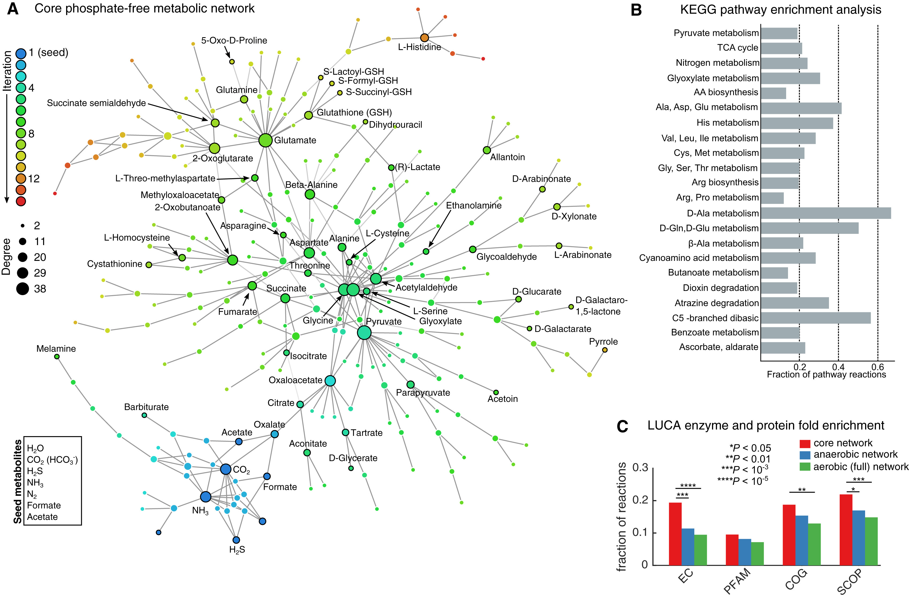
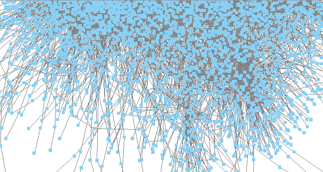

# P3 - Relatório Final de Projeto

# Apresentação

O presente projeto foi originado no contexto das atividades da disciplina de pós-graduação [*Ciência e Visualização de Dados em Saúde*](https://ds4h.org), oferecida no primeiro semestre de 2022, na Unicamp.

> |Nome  | RA | Especialização|
> |--|--|--|
> | Edoarda  | 204057  | Computação |

# Referência bibliográfica do artigo lido
> Remnants of an Ancient Metabolism without Phosphate
> Goldford, Joshua E. et al.
> Cell, Volume 168, Issue 6, 1126 - 1134.e9
 (DOI: https://doi.org/10.1016/j.cell.2017.02.001)

# Resumo
> Apesar do fosfato ser uma molécula extremamente importante para seres vivos atualmente, ela é extremamente escassa na natureza. Partindo disso, surgiu a hipótese de que na pré-história, existiam metabolismos que não faziam o uso de fosfato. Desse modo, o objetivo desse artigo é explorar a possibilidade da existência deste metabolismo, usando redes complexas e expansão de redes.

# Breve descrição do experimento/análise do artigo que foi replicado
Este trabalho é composto de vários experimentos, cujas descrições estão na seção Método e Resultados. 

## Dados usados como entrada
Dataset | Endereço na Web | Resumo descritivo
----- | :---: | -----
mmc1.xlsx | [Material Suplementar](https://www.cell.com/cell/fulltext/S0092-8674(17)30133-2#supplementaryMaterial) | Tabela S1A: *KEGG network* (reações)<br>Tabela S1B: *KEGG network* (metabólitos)
mmc2.xlsx | [Material Suplementar](https://www.cell.com/cell/fulltext/S0092-8674(17)30133-2#supplementaryMaterial) | Tabela S2A: Metabólitos da rede principal s/ Fosfatos<br>
Tabela S2B: Reações da rede principal s/ Fosfatos 

# Método e Resultados

## Ferramentas Utilizadas
Nome | Endereço na Web |
:---: | :---: | :---:
GNU Octave | https://www.gnu.org/software/octave/index | GNU Software Project
Python 3.10.4 64-bits | https://www.python.org/ | python
NetworkX | https://networkx.org/ | NetworkX
Pandas | https://pandas.pydata.org/ | Pandas
GNU Bash | https://www.gnu.org/software/bash/
Cytoscape | https://cytoscape.org/

#### 1. Reconstruction of biosphere-level metabolism
Objective: Assembly of all known metabolic reactions into a biosphere-level (or pangenome) metabolic model using the KEGG[^1] database. 
  *  Download using the [KEGG REST API](http://www.kegg.jp/kegg/docs/keggapi.html). 
  * Construct a stoichiometric matrix[^2] from the KEGG reaction database using reaction equations.
  * Remove reactions that:
    * Are elementally imbalanced for any element, except hydrogen;
    * Consume or produce compunds that (i) do not include a SMILES string[^3] or (ii) include an n-subunit polymer with undefined molecular formulas. Metabolites with arbitrary, "R" groups were retained as long as "R" groups were balanced in the reaction equations.
    <br>

    > **Expected Result**: Elementally balanced network that consists of 6880 reactions and 5944 metabolites (on Tables S1A and S1B). This network is referenced as: 
      >* "full KEGG network"
      >* "KEGG network"
      >* "Aerobic Network"

    > **Achieved Result:** This part of the experiment was skipped because I don't have the know-how of the area to replicate it and it does not seem to use complex networks.
    > Due to the above reasons, I deemed that experiment out of the scope of this discipline and used took the *Expected Result* given as correct to use in the next experiments.

[^1]: KEGG: Kyoto Encyclopedia of Genes and Genomes
[^2]: Stoichiometric matrix: Stoichiometry refers to the relationship between the quantities of reactants and products before, during, and following chemical reactions. Stoichiometry is founded on the law of conservation of mass
[^3]: SMILES String: SMILES (Simplified molecular-input line-entry system) is a line notation method to represent molecules as well as reactions. 

<!--
- Essa parte do experimento foi pulada pelo fato de necessitar conhecimento específico da área que eu não faço ideia como fazer. De qq jeito aprendi coisas interessantes como
Stoichometric Matrix:
Smiles String:
 Note that due to the filtering of KEGG reactions described above, essential for an accurate accounting of atoms, the KEGG networks used throughout the manuscript are depleted in enzymes that catalyze reactions that are chemically unbalanced (e.g., fatty acid elongation reactions, lysine biosynthesis), and in enzymes with no assigned KEGG reaction, like arsenate reductase (EC 1.20.4.4) and ketol-acidreductoi-somerase (EC 1.1.1.382). We expect that the accuracy of future analyses will increase with further improvement of KEGG and other
metabolic databases, which will better reflect the collection of biosphere-level metabolism.
-->
---
#### 2. Expand the KEGG Network
 Apply the network expansion algorithm on the KEGG network using the following metabolites: 

  | Seed metabolites | 
  |:----------------:|
  | H~2~O |
  | CO~2~ (HCO~3~^-^) |
  | H~2~S |
  | NH~3~ (Ammonia) |
  | N~2~ |
  | Formate |
  | Acetate |
  * Generally assume all reactions to be reversible (by representing each reaction twice in both forward and backward directions). 
    * The only exception is the set of reactions that involve molecular oxygen, which are not allowed to proceed in the oxygen-producing direction, in order to best mimic the conditions of the biosphere prior to the great oxidation.

  > **Expected Results**: Figure 1A, written on tables S2A and S2B.
  
  *A single track trail outside of Albuquerque, New Mexico.*
    
  > **Achieved Results:** I used the run_network_expansion.m program, located in:  
    ```
    P3/assets/networkExpansion/examples/
    ```
  > MATLAB 2015a (or an updated version) is a very paid program I don't legally have access to. 
  > Because of that I used GNU Octave to run the algorithm and all subsequent experiment steps using MATLAB. The programs don't have 1:1 compatibility between each other, but GNU Octave uses a similar language and is readily available on almost any plataform for free.
  > *run_network_expansion.m* outputs two cell vectors, *rxns* (for the reactions) and *mets* (for the molecules). The outputs were saved with the command *save*, but any attempt to save the output as a csv or any other format readable by other programs resulted in failure.
  > My solution (*gambiarra*) for that was opening the variables in the Variable Editor by right-clicking on them, copying and pasting the values in a spreadsheet program and saving that as csv.
  > Now we can (finally) compare my results with the paper's. For my ease, each sheet on *mmc2.xlxs* was split in 3 csv files named *mmc2_SHEETNAME.csv*
  > I wrote a bash script that stripped everything (molecule names, reaction results, and the header) from the given tables so I could use the *diff* command-line tool to compare my results with the paper's'.
  > I'm happy to report that the results are the same! As an extra precaution, I checked if the example script also does what the paper reported and it seems ok. However, I might not be the best person to report that part since my knowledge with MATLAB script is limited.
  >
  > Now we will try to reproduce the network. One of the files provided in the NetWorkExpansions package (*assets/networkExpansion/data/networks/network_filtered.mat*) seems to provide the reaction table for the full KEGG network.
  > According to the paper, "the stoichiometric matrix was converted into a bipartite undirected graph, where nodes were either reactions or metabolites. In this bipartite graph, an edge exists between a reaction and a metabolite if that reaction either consumes or produces that metabolite." I interpreted that as: In the stoichiometric matrix, for each (metabolite, reaction) pair, an edge exists if the value on the cell is different than zero.
  >
  > Note: My computer had a lot of trouble opening, editing or otherwise existing in proximity of the Stoichiometric Matrix file. Because of that, I couldn't investigate the network_filtered.mat file as much as I'd like. I had to ask a friend for help to save the matrix in .csv for me so I could run the Python script.
  ")
  *I swear I tried to get better pictures but my computer was giving up on me by this point. Also had to redo the script because I forgot the graph was bipartite. Ooops.*
  >
  >
  *This was the only thing that I could see on Cytoscape before it crashed (after alleged script correction)*

---
#### 3. Establish some properties of the phosphate-free network
  While the above constraints on xygen-involving reactions can be used to study the growth of metabolism through the network expansion algorithm, they cannot easily used for imposing pre-oxic conditions in enrichment analyses that use sets of KEGG reactions andenzymes. For establishing the uniqueness of some properties of the phosphate-free network, we:
   * Perform tests of statistical significance for enrichment of these properties relative to both the full KEGG network (aerobic) and the network accessible without oxygen (anaerobic network). 
     * The comparisons with the anaerobic network were performed in order to ensure that statistical enrichment tests were not biased by including reactions and enzymes likely added to the global metabolic network after oxygen accumulated in the atmosphere. 
   * Generate the anaerobic network by removing subsets of reactions and metabolites from the global metabolic network reachable only through reactions that utilize molecular oxygen, resulting in a modified biosphere-level metabolic network. 
     * Remove all reactions that utilize oxygen.
     * Convert the stoichiometric matrix into a bipartite undirected graph, where nodes were either reactions or metabolites. In this bipartite graph, an edge exists between a reaction and a metabolite if that reaction either consumes or produces that
     * Input the resulting graph into the python package NetworkX, and all connected components were detected. Identify a single major connected component that contains the majority of metabolic reactions.
  <br>
   > **Expected results**: Tables S1A and S1B, containing 5,651 reactions and 5,252 metabolites, is provided in the Tables S1A and S1B [sic].
    >> *NOTE:* I believe the authors made a mistake during the writing of this section. As mentioned before, Tables S1A and S2A contents are the full KEGG network containing 6880 balanced reactions (S1A) and 5944 metabolites (S1B). I rechecked all other tables provided, and none of them seem to contain 5651 reactions and 5252 metabolites.
    
  > **Achieved results**: Couldn't explore further due to time constraints. I also don't think I have the know how to try to replicate it.

---

### 4. Other Experiments
There were a few other experiments consisting of:
* using the network expansion algorhithm without unidirectional reactions and using certain energy thresholds to twst an autotrophic or heterotrophic origin of metabolism;
* (the last two)
But I didn't investigate further if I could replicate this experiment using my knowledge due to time constraints. 

---

## Conclusions

These experiments would probably go much more smoothly if I had access to a specialist. Knowing complex networks alone wasn't enough, and I had to learn computational structures that seem exclusive or see more use in this area.
Some parts of the experiment steps were well reported and easy to follow, but in others I had to rely on assumptions to make progress. Overall, I felt the need of a few more examples and more detailed reporting of the experiments, specially on the later ones. I also missed having access to their support scripts, since I was interested in how they plotted their networks.
I also felt the need of some extra memory on my laptop, since I wasn't able to visually inspect my generated graphs due to constant crashes.

<!--nenhum programa de leitura de csv queria ler o network.S pra eu poder juntar e montar um script no python. acabei precisando de ajuda de um amigo meu que tem a versao paga do excel nessa parte. obg thales.
    agora finalmente temos algo q parece uma edgelist??? que a gente pode tentar usar??? yey. essa parte ficou muito nebulosa no paper, talvez alguem da area apanhe menos???

    > **TODO:** final pq eu acho q nao vai dar mais pra fazer muita coisa: script python pra tentar mostrar a rede, mas principalmente, terminar esse report. e organizar os arquivos; -->

<!--    
```
Here's a simple footnote,[^1] and here's a longer one.[^bignote]

[^1]: This is the first footnote.
(this was after 1, presumidademente)
Network expansion was performed with a seed set of eight com-
pounds thought to have been available in prebiotic environ-
ments, notably lacking phosphate (Figure 1A, STAR Methods)
(Cody et al., 2000; Lang et al., 2010; Martin and Russell, 2007;
Russell et al., 2010). Importantly, the set of seed molecules we
defined contains simple carboxylic acids in the form of acetate
and formate, which could be provided by either an abiotic mech-
anism or a primitive pathway for carbon fixation (e.g., a primitive
variant of the Wood-Ljungdahl pathway [Sousa and Martin,
2014; Sousa et al., 2013; Weiss et al., 2016] or the reductive
TCA cycle [Morowitz et al., 2000; Smith and Morowitz, 2004;
Wächtershäuser, 1990], see also Discussion). The resulting
scope of this seed set consists of a fully connected network of
315 reactions and 260 metabolites (Figure 1A; Tables S2A and
S2B), the composition of which is robust to variations of the
seed set compounds (Figures S1 and S2). Although this network
requires the addition of catalytically accessible carbon, nitrogen
and sulfur sources (Figure S1), acetate and formate were substi-
tutable by several alternative carboxylic acids like pyruvate
(Figure S2).
```

| REAGENT or RESOURCE | SOURCE | IDENTIFIER |
| :-----------:|:--------:| :--------: |
| Database KEGG | (Kanehisa and Goto, 2000) | http://www.genome.jp/kegg/kegg1.html |
| LUCApedia | (Goldman et al., 2013) | http://eeb.princeton.edu/lucapedia/ |
| MIPS | (Hemavathi et al., 2009) | http://dicsoft2.physics.iisc.ernet.in/cgi-bin/mips/query.pl | 
| eQuilibrator | (Flamholz et al., 2012) | http://equilibrator.weizmann.ac.il/ |
| MATLAB 2015a | Mathworks | https://www.mathworks.com/
| Python v. 2.7.13| Python | https://www.python.org/
| Inkscape 0.91| Inkscape | https://inkscape.org/
| NetworkX 1.11| Network X| https://networkx.github.io/
|D3.js| Mike Bostock| https://d3js.org/
|Webweb.js 3.2| Daniel B. Larremore| http://danlarremore.com/webweb/|
|Network expansion algorithm|(Ebenhöh et al., 2004)|https://github.com/segrelab/networkExpansion

We constructed a stoichiometric matrix from the KEGG reaction database using reaction equations. Reactions
were removed if they either consumed or produced compounds that (i) did not include a SMILES string or (ii) included an n-subunit
polymer with undefined molecular formulas.

The final list of chemical reactions
is provided in Tables S1A and S1B.

Second,
the stoichiometric matrix was converted into a bipartite undirected graph, where nodes were either reactions or metabolites. In this
bipartite graph, an edge exists between a reaction and a metabolite if that reaction either consumes or produces that metabolite.

## Fontes e sites i guess
https://chemicbook.com/2021/02/13/smiles-strings-explained-for-beginners-part-1.html -->